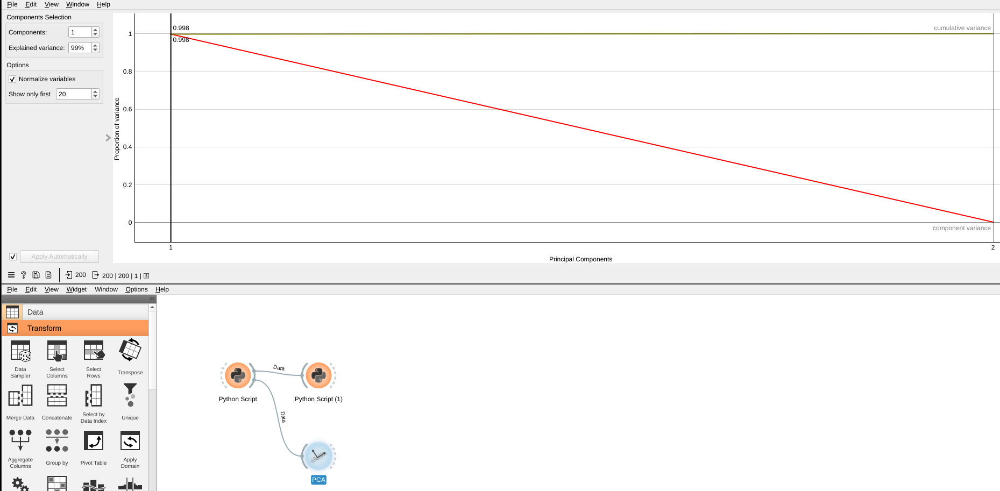

# Lab 10: Dimensionality Reduction

---

# Overview

In this lab, we will be using Orange3 to perform dimensionality reduction.

## Objectives

- Understand the concept of dimensionality reduction
- Learn how to use Orange3 to perform dimensionality reduction

## Prerequisites

- You have read the lecture notes on dimensionality reduction.
- You have read the lecture notes on PCA.

# Introduction

Dimensionality reduction is the process of reducing the number of random variables under consideration by obtaining a set of principal variables. It can be divided into feature selection and feature extraction. Feature selection selects a subset of the original features, while feature extraction transforms the data into a lower-dimensional space.

The goal of dimensionality reduction is to reduce the complexity of the data while preserving the most important information. This can help to improve the performance of machine learning algorithms by reducing overfitting and reducing the computational cost.

In this lab, we will be using Orange3 to perform dimensionality reduction on a dataset. Please create a new workflow in Orange3.

## Getting Started

We first initialize a some random data with `Python Script` widget. Please add a `Python Script` widget and connect it to the `File` widget. Please copy and paste the following code into the `Python Script` widget.

```python
import numpy as np
from Orange.data import Table, Domain, ContinuousVariable

domain = Domain([ContinuousVariable("x1"),
                 ContinuousVariable("x2")])

# set seed
np.random.seed(0)
x1 = np.random.normal(0, 50, 200)
x2 = x1 + np.random.normal(0, 5, 200)

X = np.column_stack((x1,x2))

arr = list(zip(x1, x2))
out_data = Table.from_numpy(domain, arr)
```

## Principal Component Analysis (PCA)

Let's start with Principal Component Analysis (PCA) with our custom implementation. Please add a `Python Script` widget and connect it to the `Python Script` widget. Please copy and paste the following code into the `Python Script` widget.

```python
import numpy as np
from Orange.data import Table, Domain, ContinuousVariable

data = in_data._X
data = data - data.mean(axis=0)
#Calculate coveriance matix
S=np.cov(data.T)
# Calculate eigenvalues and eigenvectors
eigenvalues, eigenvectors = np.linalg.eig(S)
# sort the eigenvalues and associated eigenvectors decreasing order
index = np.argsort(eigenvalues)[::-1]
eigenvalues,eigenvectors = eigenvalues[index], eigenvectors[:, index]
# transform the samples onto the new subspace 
Z = np.dot(data,eigenvectors)

print(eigenvalues, eigenvectors, Z)

out_data = Table.from_numpy(in_data.domain, Z)
out_object = Table.from_numpy(in_data.domain, eigenvectors)
```

You will see the eigenvalues, eigenvectors, and transformed data in the output.


## Apply PCA with Orange3

Orange3 has a `PCA` widget that implements the PCA algorithm. Please drag in a `PCA` widget and connect it to the `File` widget. Please set the `Number of components` to 2.



## Visualize the transformed data

To visualize the transformed data in Orange3, please add a `Scatter Plot` widget and connect it to the `data` output of `PCA` widget. The `Scatter Plot` widget will display the transformed data.


However, it's not able to display the eigenvectors. To display the eigenvectors, please add a `Data Table` widget and connect it to the `object` output of `PCA` widget. You will see the eigenvectors in the `Data Table` widget.

## Apply PCA to Handwritten Digits

Let's apply PCA to the Handwritten Digits dataset. Please create a Python script to load the Handwritten Digits dataset from `sklearn` and connect it to the `PCA` widget. Please copy and paste the following code into the `Python Script` widget.

```python
import numpy as np
from Orange.data import Table, Domain, ContinuousVariable
from sklearn.datasets import load_digits

X, Y = load_digits(return_X_y=True)

domain = Domain([ContinuousVariable(f'p{i}') for i in range(digits.data.shape[1])], ContinuousVariable.make("digi"))

out_data = Table.from_numpy(domain, X, Y)
```

After that, please connect the `PCA` widget to the `Python Script` widget. Please set the `Number of components` to 2.


After that, please add a `Scatter Plot` widget and connect it to the `data` output of `PCA` widget. The `Scatter Plot` widget will display the transformed data.


Please set the `Color` to `digi` to see the different digits.
