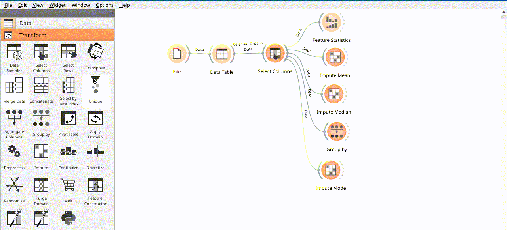

# Lab 3: Data processing with Orange

---

# Introduction to Orange

## What is Orange?

Orange is a Python library that provides a high-level interface to the [Orange](https://orange.biolab.si/) data mining framework. Orange is a component-based data mining and machine learning software suite written in Python, which includes a wide range of standard data mining and machine learning techniques, as well as a few more experimental techniques. Orange is an open source project that is distributed under the terms of the GNU General Public License. It's available for Windows, Linux, and Mac OS X.

## What is Orange good for?

Orange is a great tool for teaching, prototyping, and developing data mining and machine learning algorithms. It provides a visual programming environment that allows users to quickly connect data preprocessing, data mining, and visualization components to create analysis workflows. Orange also provides a Python API that allows users to write scripts to automate analysis workflows. Orange is also a great tool for teaching data mining and machine learning because it provides a visual programming environment that allows students to focus on the concepts of data mining and machine learning without having to worry about the details of programming.

## What is Orange not good for?

Orange is not a high-performance data mining and machine learning library. It's not designed to be used for large-scale data mining and machine learning problems. It's designed to be used for small-scale data mining and machine learning problems. It's also not designed to be used for real-time data mining and machine learning problems. It's designed to be used for batch data mining and machine learning problems.

# Getting Started with Orange

You will need a Python environment to run Orange. If you don't have one, you can install Anaconda, which is a Python distribution that includes Orange. You can download Anaconda from [https://www.anaconda.com/download/](https://www.anaconda.com/download/).

## Installation

Orange is available for Windows, Linux, and Mac OS X. It can be installed using the following command in terminal with Python environment:

```sh
python -m pip install orange3
```

## Running Orange

Orange can be run using the following command in terminal with Python environment:

```sh
python -m orange-canvas
```

## Create a new workflow

When you run Orange, you will see the following window:


To create a new workflow, simply click on `New` or `File` > `New` and select `Workflow`. This will open a new workflow window.

*Remarks:*
- I can't find the `Workflow` option

---

# Orange Basics

In this section, we will learn how to use Orange to load data and process it. We will also learn how to visualize the data and save the results.

## Loading the data

To load data, we will use the `File` widget. Drag and drop it to the workflow canvas. Double click on it to open the widget settings. There are several built-in datasets in the file list. Click on the `...` button and select the `titanic.csv` file, or load dataset from URL by pasting [https://github.com/datasciencedojo/datasets/raw/master/titanic.csv](https://github.com/datasciencedojo/datasets/raw/master/titanic.csv) in `URL`, and press `Enter` to load it. The widget will automatically load the data and display it in the widget output.


## Viewing the data

To view the data, we will use the `Data Table` widget. Drag and drop it to the workflow canvas. Connect the `File` widget to the `Data Table` widget. Double click on the `Data Table` widget to open the widget settings. The widget will automatically display the data in the widget output.


## About the Data

This dataset was used to apply machine learning algorithms to predict which passengers survived the tragedy. More details will be found in __[Titanic: Machine Learning from Disaster](https://www.kaggle.com/c/titanic#description)__

- `passengerId, Ticket` are basically random numbers and thus we assume that do not contain any valuable information.
- `Survived, Passenger Class, Age Siblings Spouses, Parents Children` and `Fare` are numerical values
- `Sex, Embarked` are categorical features that we need to map to integer values.
- `Name, Cabin` might also contain valuable information, but we will ignore them in this example

## Drop unnecessary columns

To drop unnecessary columns, we will use the `Select Columns` widget. Drag and drop it to the workflow canvas. Connect the `File` widget to the `Select Columns` widget. Double click on the `Select Columns` widget to open the widget settings. Select the columns (`PassengerId`, `Ticket`,`Cabin`,`Name`) that we want to drop and click on `Commit`. The widget will automatically display the data in the widget output.


## Data statistics

To view the data statistics, we will use the `Feature Statistics` widget. Drag and drop it to the workflow canvas. Connect the `Data Table` widget to the `Feature Statistics` widget. Double click on the `Feature Statistics` widget to see details statistics for all columns.


You will see the following statistics:


## Handle missing values

Missing values are a common problem in data analysis. There are many ways to handle missing values. One way is to remove the rows with missing values. Another way is to replace the missing values with the mean or median of the column.

### Handle missing values in numerical columns by replacing them with the mean

To handle missing values in numerical columns by replacing them with the mean or median, we will use the `Impute` widget. Drag and drop it to the workflow canvas. Connect the `Select Columns` widget to the `Impute` widget. Double click on the `Impute` widget to open the widget settings. Select the columns you want to impute and select the imputation method. The widget will automatically display the data in the widget output.


We may rename the node by right clicking on the node and select `Rename`. Please rename it as `Impute Mean`.

### Handle missing values in numerical columns by replacing them with the median

As we could know from the statistics, the median of `Age` column is `28.0`. To handle missing values in numerical columns by replacing them with the median, we will use the `Impute` widget. Drag and drop it to the workflow canvas. Connect the `Select Columns` widget to the `Impute` widget. Double click on the `Impute` widget to open the widget settings. Select the columns you want to impute and input `28.0` in the `Fixed value` field. The widget will automatically display the data in the widget output.


We may rename the node by right clicking on the node and select `Rename`. Please rename it as `Impute Median`.

## Guess the values of age based on different groups

Another strategy to handle missing values in numerical columns is to guess the values based on different groups. For example, we can guess the values of `Age` based on the `Sex` and `Pclass` columns.

Let's group the data by `Sex` and `Pclass` columns. To group the data, we will use the `Group by` widget. Drag and drop it to the workflow canvas. Connect the `Select Columns` widget to the `Group by` widget. Double click on the `Group by` widget to open the widget settings. Select the columns you want to group, select column `Age` for aggregation and select the aggregation method `Mean`. The widget will automatically display the data in the widget output.


## Handing missing value by mode value

To handle missing values in categorical columns by replacing them with the mode value, we will use the `Impute` widget. Drag and drop it to the workflow canvas. Connect the `Select Columns` widget to the `Impute` widget. Double click on the `Impute` widget to open the widget settings. Select the columns you want to impute and select the imputation method `Most frequent`. The widget will automatically display the data in the widget output.


We may rename the node by right clicking on the node and select `Rename`. Please rename it as `Impute Mode`.

## Feature Type Conversion

In this dataset, `Sex` and `Embarked` are categorical features that we need to map to integer values. To convert categorical features to numerical features, we will use the one-hot encoding method. For `Sex`, we will use simple mapping method.

### One-hot encoding for `Embarked` column

To convert categorical features to numerical features using one-hot encoding, we will use the `Continuize` widget. Drag and drop it to the workflow canvas. Connect the `Impute Mean` widget to the `Continuize` widget. Double click on the `Continuize` widget to open the widget settings. Select the columns you want to encode and select `One-hot encoding`. The widget will automatically display the data in the widget output.




### Ordinal value for 'Sex' column

To convert categorical features to numerical features using simple mapping method, we will use the `Continuize` widget. Drag and drop it to the workflow canvas. We will reuse the `Continuize` widget we used for one-hot encoding. Double click on the `Continuize` widget to open the widget settings. Select the columns you want to encode and select `Ordinal`. The widget will automatically display the data in the widget output.


## Feature Construction: Family Size

To create a new feature `Family Size`, we will use the `Formula` widget. Drag and drop it to the workflow canvas. Connect the `Continuize` widget to the `Formula` widget. Double click on the `Formula` widget to open the widget settings. Click on `New > Numeric` to create a new numeric feature. Input `Family Size` as the feature name and input `SibSp + Parch + 1` as the feature expression. The widget will automatically display the data in the widget output.

