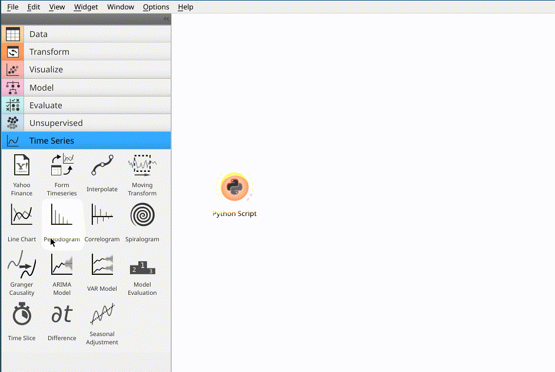
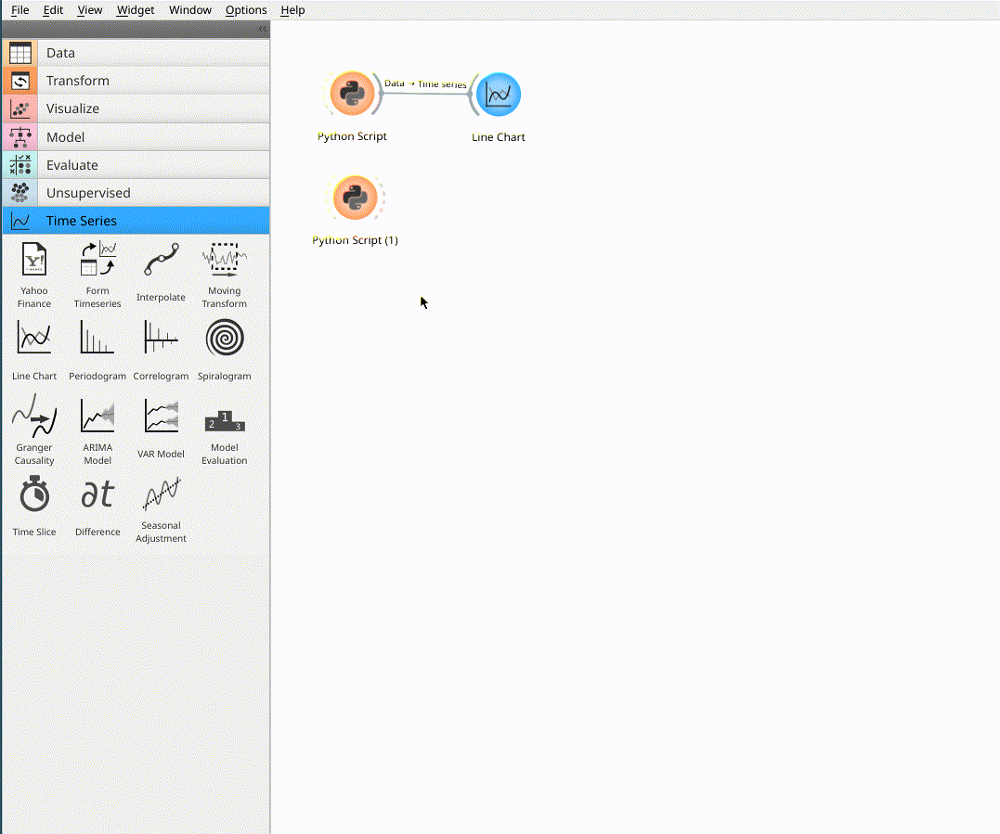
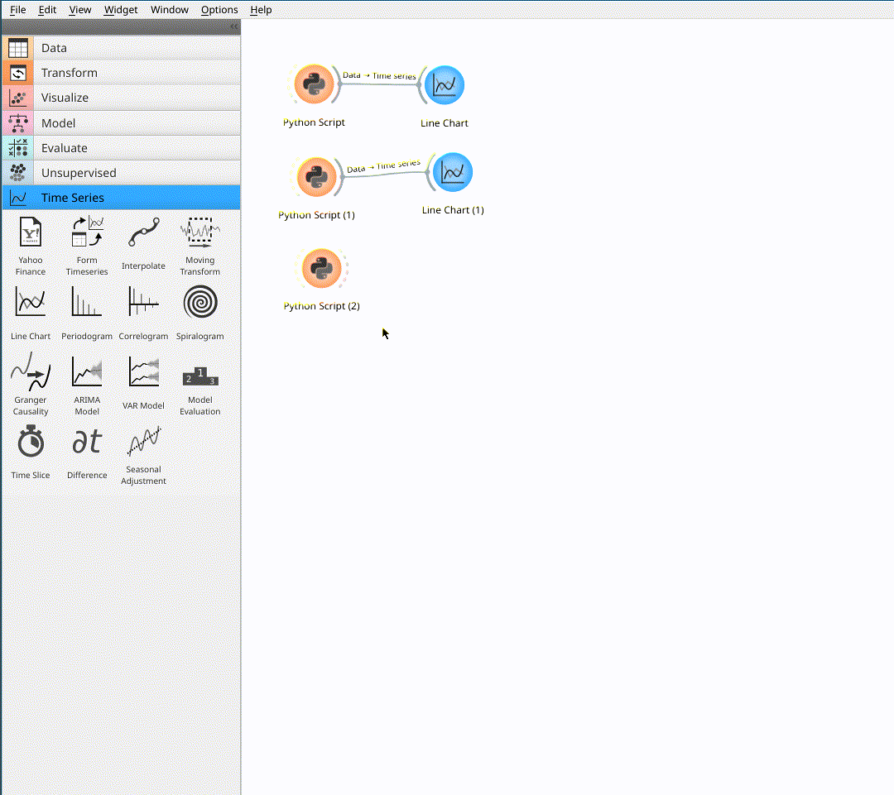
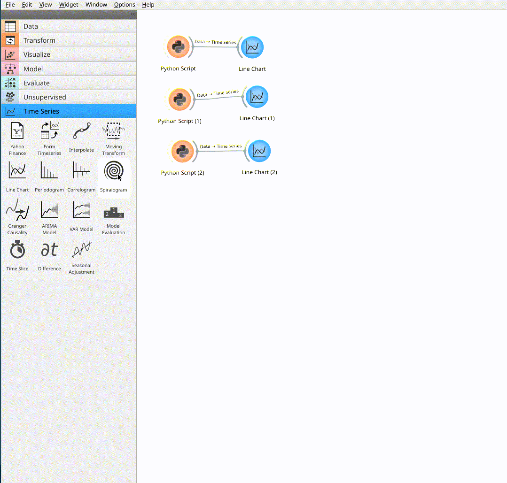
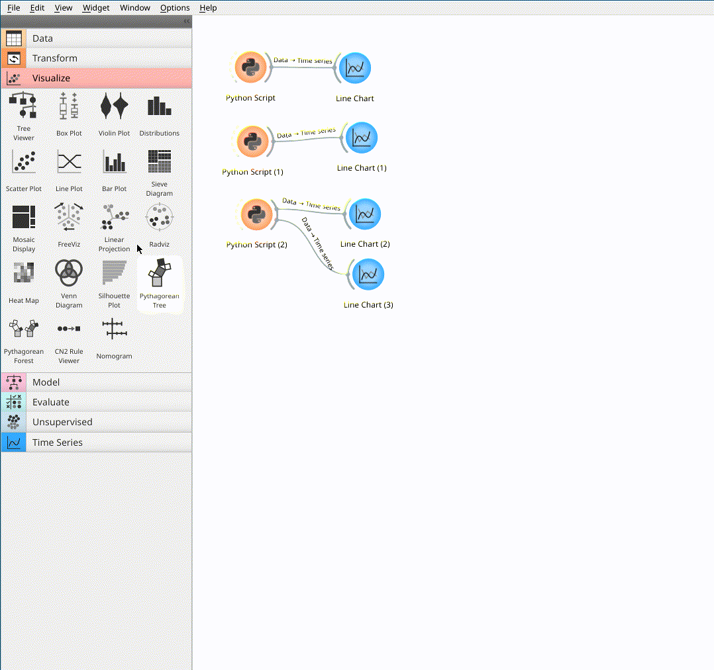
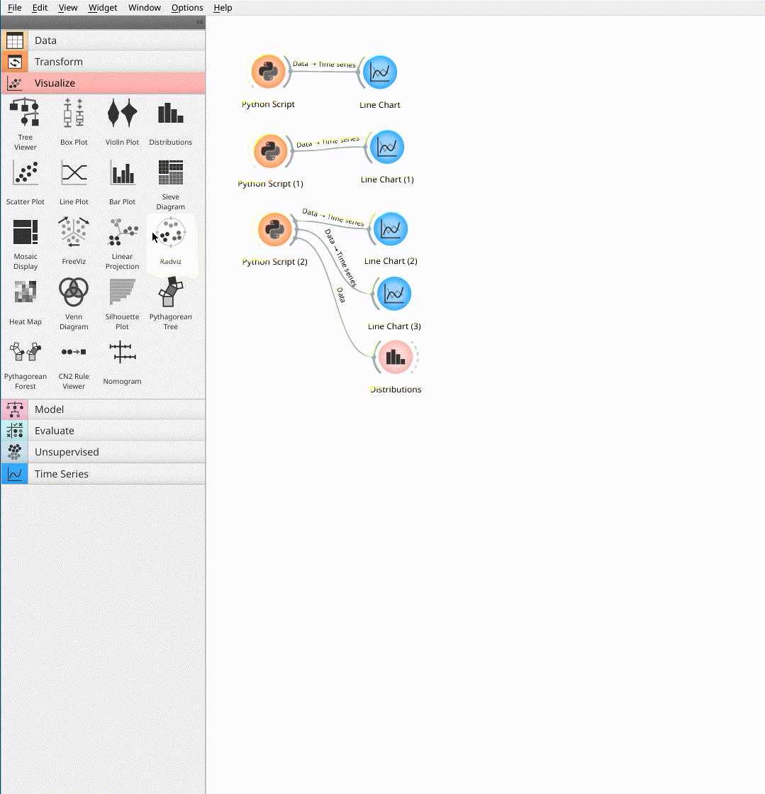
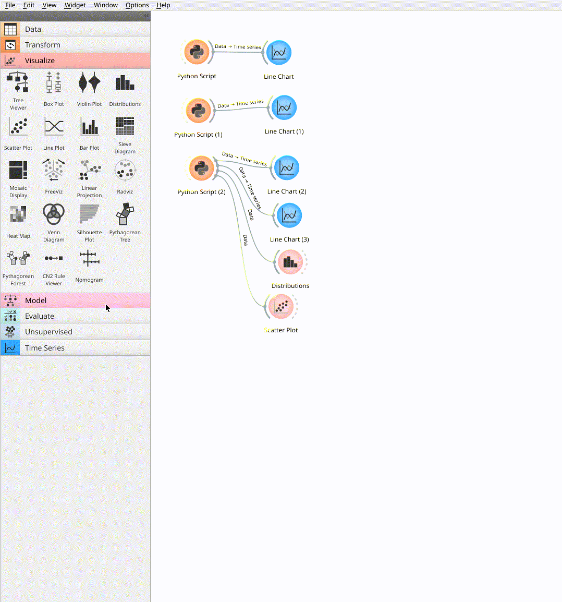

# COMP3115: Exploratory Data Analysis and Visualization

---

# Lab 4: Data Visualization in Orange

In this lab, you will learn how to use Orange to visualize data. You will learn how to use scatter plots, box plots, and histograms to visualize data. You will also learn how to use different types of plots to visualize different types of data.

## Dependencies

You will need to install the following dependencies in terminal with a Python environment:

```commandline
pip install orange3-timeseries
```

## Line Chart

Let's talk about line charts. Line charts are used to visualize data that changes over time. For example, you can use line charts to visualize the stock price of a company over time. You can also use line charts to visualize the number of COVID-19 cases over time.

### Simple Line Chart with 3 Points

Let's create some sample data with `Python Script` widget. Add the following code to the widget:

```python
from Orange.data import Table, Domain, ContinuousVariable, DiscreteVariable

domain = Domain([ContinuousVariable("x"),
                 ContinuousVariable("y")])

x = [1,2,3]
y = [-2,5,-8]

arr = list(zip(x, y))

out_data = Table.from_numpy(domain, arr)
```

The code above creates a table with two columns: `x` and `y`. The table has three rows. The first row has `x=1` and `y=-2`. The second row has `x=2` and `y=5`. The third row has `x=3` and `y=-8`.

To visualize the data, add `Line Chart` widget from `Time Series` panel to the canvas. Connect the output of `Python Script` widget to the input of `Line Chart` widget. Run the workflow. You should see the following plot:



### Line Chart with 50 Points

Let's create a table with 50 points. Add the following code to `Python Script` widget:

```python
import numpy as np
from Orange.data import Table, Domain, ContinuousVariable, DiscreteVariable

domain = Domain([ContinuousVariable("x"),
                 ContinuousVariable("y")])

N = 50
x = np.arange(1,N+1)
y = np.random.randn(N)

arr = list(zip(x, y))
out_data = Table.from_numpy(domain, arr)
```

It's the same code as before, but we are using `numpy` to generate random numbers. The code above creates a table with two columns: `x` and `y`. The table has 50 rows of random number.

To visualize the data, add `Line Chart` widget from `Time Series` panel to the canvas. Connect the output of `Python Script` widget to the input of `Line Chart` widget. Run the workflow. You should see the following plot:



### Line Chart with 2 Lines

Let's create a table with 50 points. Add the following code to `Python Script` widget:

```python
import numpy as np
from Orange.data import Table, Domain, ContinuousVariable, DiscreteVariable

domain = Domain([ContinuousVariable("x"),
                 ContinuousVariable("y"),
                 ContinuousVariable("z")])

N = 50 
x = np.arange(1,N+1)
y = np.random.randn(N)

arr = list(zip(x, 4*y, np.abs(10*y)-x))
out_data = Table.from_numpy(domain, arr)
```

The code is similar to the previous example, but we are creating a table with three columns: `x`, `y`, and `z`. The table has 50 rows of random numbers.

To visualize the data, add `Line Chart` widget from `Time Series` panel to the canvas. Connect the output of `Python Script` widget to the input of `Line Chart` widget. Run the workflow. You should see the following plot:



### Line Chart with 2 plots

We could also separate the two lines into two plots with `Line Chart`. Please add `Line Chart` widget from `Time Series` panel to the canvas. Connect the output of `Python Script` widget to the input of `Line Chart` widget. Add a new plot in the setting. Run the workflow. You should see the following plot:



## Histograms and bins

Histograms are used to visualize the distribution of data. For example, you can use histograms to visualize the distribution of the height of people in a population. You can also use histograms to visualize the distribution of the number of COVID-19 cases in a country.

To visualize the distribution of data, add `Distribution` widget from `Visualize` panel to the canvas. Connect the output of `Python Script` widget to the input of `Distribution` widget. Run the workflow. You should see the following plot:



You could adjust the number of bins by setting corresponding bin width in the widget.

## Scatter Plot

Scatter plots are used to visualize the relationship between two variables. For example, you can use scatter plots to visualize the relationship between the height and weight of people in a population. You can also use scatter plots to visualize the relationship between the number of COVID-19 cases and the number of COVID-19 deaths in a country.

To visualize the relationship between two variables, add `Scatter Plot` widget from `Visualize` panel to the canvas. Connect the output of `Python Script` widget to the input of `Scatter Plot` widget. Run the workflow. You should see the following plot:



You may adjust the size of the dots by setting the size of the dots in the widget.

## Box Plot

Box plot is used to visualize the distribution of data. For example, you can use box plots to visualize the distribution of the height of people in a population. You can also use box plots to visualize the distribution of the number of COVID-19 cases in a country.

To visualize the distribution of data, add `Box Plot` widget from `Visualize` panel to the canvas. Connect the output of `Python Script` widget to the input of `Box Plot` widget. Run the workflow. You should see the following plot:




