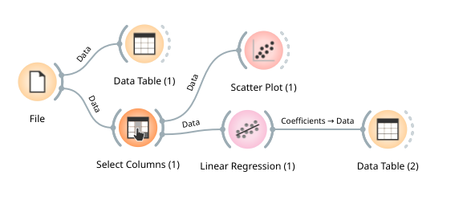

# Lab 6: Linear Regression with Orange
---

# Introduction to Linear Regression

Linear regression is a supervised learning algorithm that is used to predict the value of a continuous variable. Linear regression is a simple algorithm that is easy to understand and implement. Linear regression is often used as a baseline algorithm to compare the performance of more complex algorithms.

## Generating synthetic data for experiments

Given a data set with pairs of input feature vector and output value(s), a regression model can be learned. There are different regression models that you can try, including linear regression, ridge Regression, etc.

Let us consider the simplest form of a linear regression model (i.e., fitting a straight line to one-dimensional input data). This simple model can be extended to model more complicated data behavior.

We will start with the most familiar linear regression, a straight-line fit to data. A straight-line fit is a model of the form $y = θ1x + θ0$ where $θ1$ is commonly known as the slope, and 
$θ0$ is commonly known as the intercept (also known as bias).

Consider the following data which is generated by scattering about a line with a slope of 2 and an intercept of -5 with some random fluctuations. We will use Orange to generate synthetic data for experiments. Orange provides a number of data generators that can be used to generate synthetic data for experiments. The following code snippet shows how to generate a dataset with 100 instances and 2 features using the `Python Script` widget:

```python
import numpy as np
from Orange.data import Table, Domain, ContinuousVariable, DiscreteVariable

domain = Domain([ContinuousVariable("x"),
                 ContinuousVariable("y")])

rng = np.random.RandomState(1)
x = 10 * rng.rand(50)          # randomly generated input x
y = 2 * x - 5 + rng.randn(50)  # use theta_1*x + theta_0 + noise to generated output y

arr = list(zip(x, y))
out_data = Table.from_numpy(domain, arr)
```

The code above creates a table with two columns: `x` and `y`.

## Transforming data to features and target

The first step in building a regression model is to transform the data into features and target. The features are the input variables that are used to predict the target variable. The target variable is the variable that we want to predict. In the case of linear regression, the features are the input variables and the target is the output variable.

Let's use the `Select Columns` widget to select the `x` and `y` columns as features and target, respectively. The `Select Columns` widget can be found in the `Data` category. The `Select Columns` widget allows users to select column by name or by index. The `Select Columns` widget outputs a data table with the selected columns.


## Visualizing data

Before building a regression model, it is a good idea to visualize the data. The `Scatter Plot` widget can be used to visualize the data. The `Scatter Plot` widget can be found in the `Visualize` category. The `Scatter Plot` widget displays a scatter plot of the input data. The `Scatter Plot` widget can be used to visualize the relationship between the input variables and the target variable.


## Apply linear regression

The `Linear Regression` widget can be found in the `Regression` category. The `Linear Regression` widget learns a linear regression model from the input data. The `Linear Regression` widget outputs a model that can be used to predict the target variable.

In order to see the result coefficients, we can connect the `Linear Regression` widget to the `Data Table` widget. The `Data Table` widget can be found in the `Data` category. The `Data Table` widget displays the input data in a tabular format. The `Data Table` widget can be used to inspect the input data and the output data.


## Drawing regression line on the scatter plot

To draw the regression line on the scatter plot, we can update the `Scatter Plot` widget to show the regression line. Please check the `Show regression line` checkbox in the `Scatter Plot` widget.


# Case Study: Predicting the price of a house

In this case study, we will use linear regression to predict the price of a house. The data set contains information about houses in the Boston area. The data set contains 506 instances and 14 features. The features include the average number of rooms per dwelling, the percentage of lower status of the population, etc. The target variable is the median value of owner-occupied homes in $1000s.


The following table shows the first 5 instances in the data set:

| CRIM    | ZN   | INDUS | CHAS | NOX   | RM    | AGE  | DIS    | RAD | TAX   | PTRATIO  | B      | LSTAT  | MEDV  |
|---------|------|-------|------|-------|-------|------|--------|-----|-------|----------|--------|--------|-------|
| 0.00632 | 18.0 | 2.31  | 0.0  | 0.538 | 6.575 | 65.2 | 4.0900 | 1.0 | 296.0 | 15.3     | 396.90 | 4.98   | 24.0  |
| 0.02731 | 0.0  | 7.07  | 0.0  | 0.469 | 6.421 | 78.9 | 4.9671 | 2.0 | 242.0 | 17.8     | 396.90 | 9.14   | 21.6  |
| 0.02729 | 0.0  | 7.07  | 0.0  | 0.469 | 7.185 | 61.1 | 4.9671 | 2.0 | 242.0 | 17.8     | 392.83 | 4.03   | 34.7  |
| 0.03237 | 0.0  | 2.18  | 0.0  | 0.458 | 6.998 | 45.8 | 6.0622 | 3.0 | 222.0 | 18.7     | 394.63 | 2.94   | 33.4  |
| 0.06905 | 0.0  | 2.18  | 0.0  | 0.458 | 7.147 | 54.2 | 6.0622 | 3.0 | 222.0 | 18.7     | 396.90 | 5.33   | 36.2  |

The following table shows the description of the features in the data set:

| Feature   | Description                                                                                       |
|-----------|---------------------------------------------------------------------------------------------------|
| CRIM      | per capita crime rate by town                                                                     |
| ZN        | proportion of residential land zoned for lots over 25,000 sq.ft.                                  |
| INDUS     | proportion of non-retail business acres per town                                                  |
| CHAS      | Charles River dummy variable (= 1 if tract bounds river; 0 otherwise)                             |
| NOX       | nitric oxides concentration (parts per 10 million)                                                |
| RM        | average number of rooms per dwelling                                                              |
| AGE       | proportion of owner-occupied units built prior to 1940                                            |
| DIS       | weighted distances to five Boston employment centres                                              |
| RAD       | index of accessibility to radial highways                                                         |
| TAX       | full-value property-tax rate per $10,000                                                          |
| PTRATIO   | pupil-teacher ratio by town                                                                       |
| B         | %5E2) where Bk is the proportion of blacks by town |
| LSTAT     | % lower status of the population                                                                  |
| MEDV      | Median value of owner-occupied homes in $1000's                                                    |

## Loading the dataset

The data is available in the `housing.tab` file. The data set can be loaded using the `File` widget. The `File` widget can be found in the `Data` category. The `File` widget allows users to load data from a file.


You may connect the `File` widget to a `Data Table` in order to view the data.

## Apply linear regression to the data

Let's try to apply linear regression to the data by using the `Linear Regression` widget. After applying linear regression to the data, we can connect the `Linear Regression` widget to the `Data Table` widget to see the result coefficients.

Finally, you will have a graphical workflow that looks like the following:



## Evaluation metrics

There are different metrics that can be used to evaluate the performance of a regression model. The most common metrics are mean absolute error (MAE), mean squared error (MSE), root mean squared error (RMSE) and R2 score.

**MAE** is the average of the absolute differences between the predicted values and the actual values. MSE is the average of the squared differences between the predicted values and the actual values. RMSE is the square root of MSE. R2 score is the proportion of the variance in the dependent variable that is predictable from the independent variable(s).

**MSE** is the most commonly used metric for regression problems. However, it is difficult to interpret because it is not in the same unit as the target variable.

**RMSE** is the square root of MSE, and it is in the same unit as the target variable. Therefore, RMSE is easier to interpret than MSE.

**R2** score is a normalized version of MSE. R2 score is between 0 and 1. R2 score is 1 when the model perfectly predicts the target variable. R2 score is 0 when the model does not predict the target variable.

The following table shows the formulas for these metrics:

| Metric | Formula                                                                                                                                                                                      |
|--------|----------------------------------------------------------------------------------------------------------------------------------------------------------------------------------------------|
| MAE    |                                                                           |
| MSE    | %5E2)                       |
| RMSE   | %5E2%7D) |
| R2     | %5E2%7D%7B%5Csum_%7Bi%3D1%7D%5E%7Bn%7D(y_i-%5Cbar%7By%7D)%5E2%7D)                                                                      |

## Cross Validation

Cross validation is a technique that is used to evaluate the performance of a model. Cross validation is used to estimate how well a model will perform on unseen data. Cross validation is used to reduce the risk of overfitting a model.

### K-fold cross validation

K-fold cross validation is a type of cross validation. K-fold cross validation is used to evaluate the performance of a model. K-fold cross validation is used to estimate how well a model will perform on unseen data. K-fold cross validation is used to reduce the risk of overfitting a model.


## Evaluating the model with cross validation

To evaluate the performance of the model using cross validation and different evaluation metrics, we can use the `Test & Score` widget. The `Test & Score` widget can be found in the `Evaluate` category. The `Test & Score` widget evaluates the performance of a model on a data set. The `Test & Score` widget outputs a data table with the predicted values and the actual values.

