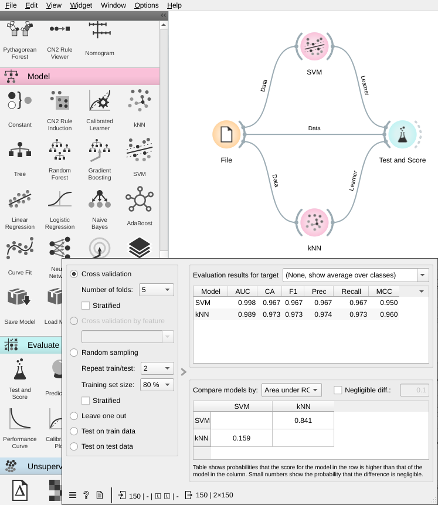

# Lab 8: Support Vector Machine and KNN with Orange

---

# Introduction

In this lab, we will use Orange to classify data using Support Vector Machine (SVM) and K-Nearest Neighbors (KNN).

## Objectives

- Understand the concept of Support Vector Machine (SVM)
- Learn how to use Orange to classify data using SVM.
- Understand the concept of K-Nearest Neighbors (KNN)
- Learn how to use Orange to classify data using KNN.
- Understand the concept of cross-validation

## Prerequisites

- You have read the lecture notes on SVM and KNN.
- You have read the lecture notes on cross-validation.

## Dataset

In this lab, we will use the Iris dataset. The Iris dataset contains 150 instances of three classes: Iris-setosa, Iris-versicolor, and Iris-virginica. Each instance has four attributes: sepal length, sepal width, petal length, and petal width. The dataset could be loaded with the `File` widget in Orange. The dataset is located at `iris.tab`. Please drag the `File` widget to the canvas and connect it to the `Data Table` widget. The `Data Table` widget will display the data.

# Support Vector Machine (SVM)

Support Vector Machine (SVM) is a supervised machine learning algorithm that can be used for both classification and regression. The main idea of SVM is to find a hyperplane that separates the data into two classes. The hyperplane is chosen so that the distance between the hyperplane and the nearest data point from each class is maximized. The data points that are closest to the hyperplane are called support vectors.

## Linear SVM classifier

Linear SVM is used when the data is linearly separable. In this case, the hyperplane is a line that separates the data into two classes. A classifier is built based on the hyperplane. The classifier will predict the class of a new data point based on which side of the hyperplane the data point is located. It's a binary classifier, which means it can only classify data into two classes.

## Labeling the data

In this example, we would like to classify if an iris is either `setosa` or `virginica` or not.

## Build an SVM classifier with RBF kernel

Let's drag the SVM widget to the canvas and connect it to the `Data Table` widget. The `SVM` widget will display the SVM parameters. The `SVM` widget has two parameters: `kernel` and `C`. The `kernel` parameter specifies the kernel function used to map the data points to a higher dimensional space. The `C` parameter specifies the penalty for misclassified data points. The `SVM` widget also has two outputs: `Model` and `Predictions`. The `Model` output is used to display the SVM model. The `Predictions` output is used to display the predictions of the SVM model.

Please set the `kernel` parameter to `RBF` , the `C` parameter to `1.0` and uncheck the `Iteration limit`.

## Evaluation

Let's drag a `Test & Score` widget to the canvas and connect it to the `Predictions` output of the `SVM` widget. The `Test & Score` widget will display the evaluation results. The `Test & Score` widget has two inputs: `Data` and `Predictions`. The `Data` input is used to display the data. The `Predictions` input is used to display the predictions of the SVM model. The `Test & Score` widget has two outputs: `Evaluation Results` and `Predictions`. The `Evaluation Results` output is used to display the evaluation results. The `Predictions` output is used to display the predictions of the SVM model.

# K-Nearest Neighbors (KNN)

K-Nearest Neighbors (KNN) is a supervised machine learning algorithm that can be used for both classification and regression. The main idea of KNN is to find the K nearest data points to the new data point and use the majority class of the K nearest data points to predict the class of the new data point. The distance between the data points is calculated using Euclidean distance.

## KNN classifier

KNN classifier is used when the data is not linearly separable. In this case, the classifier will predict the class of a new data point based on the majority class of the K nearest data points. It's a multi-class classifier, which means it can classify data into more than two classes.

## Labeling the data