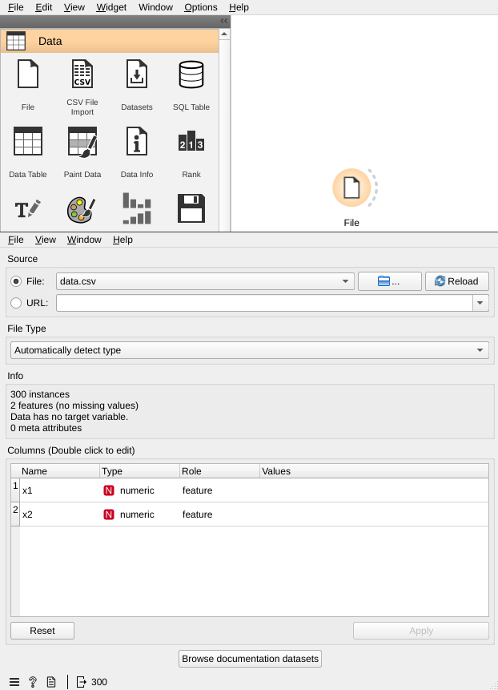
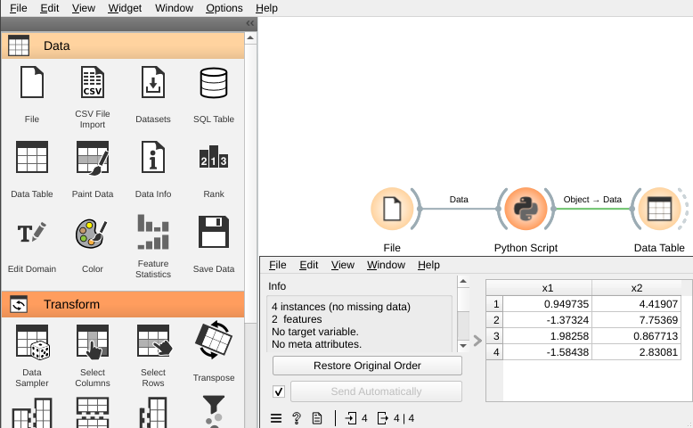
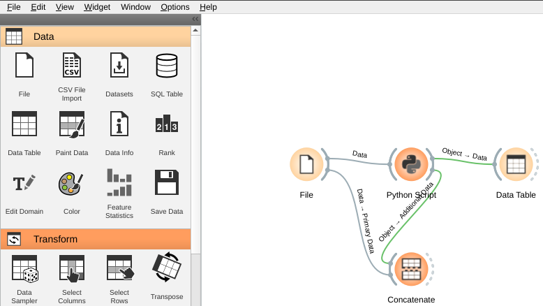
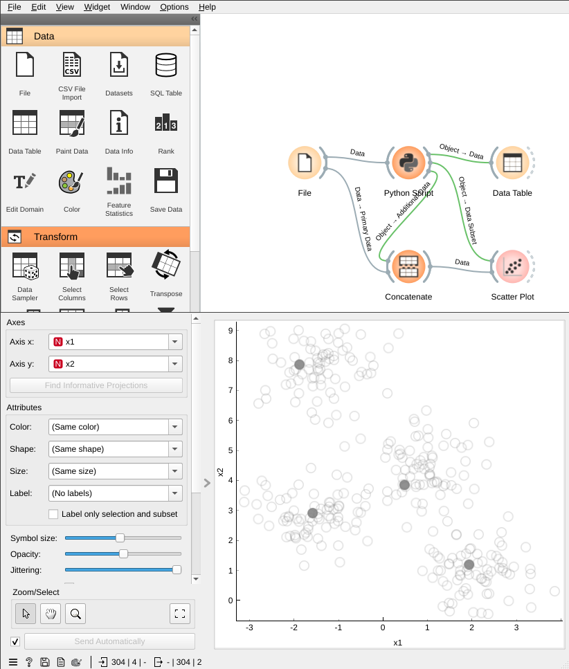
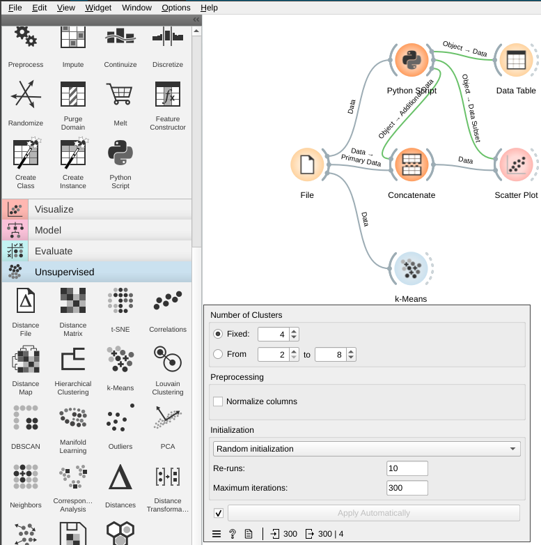
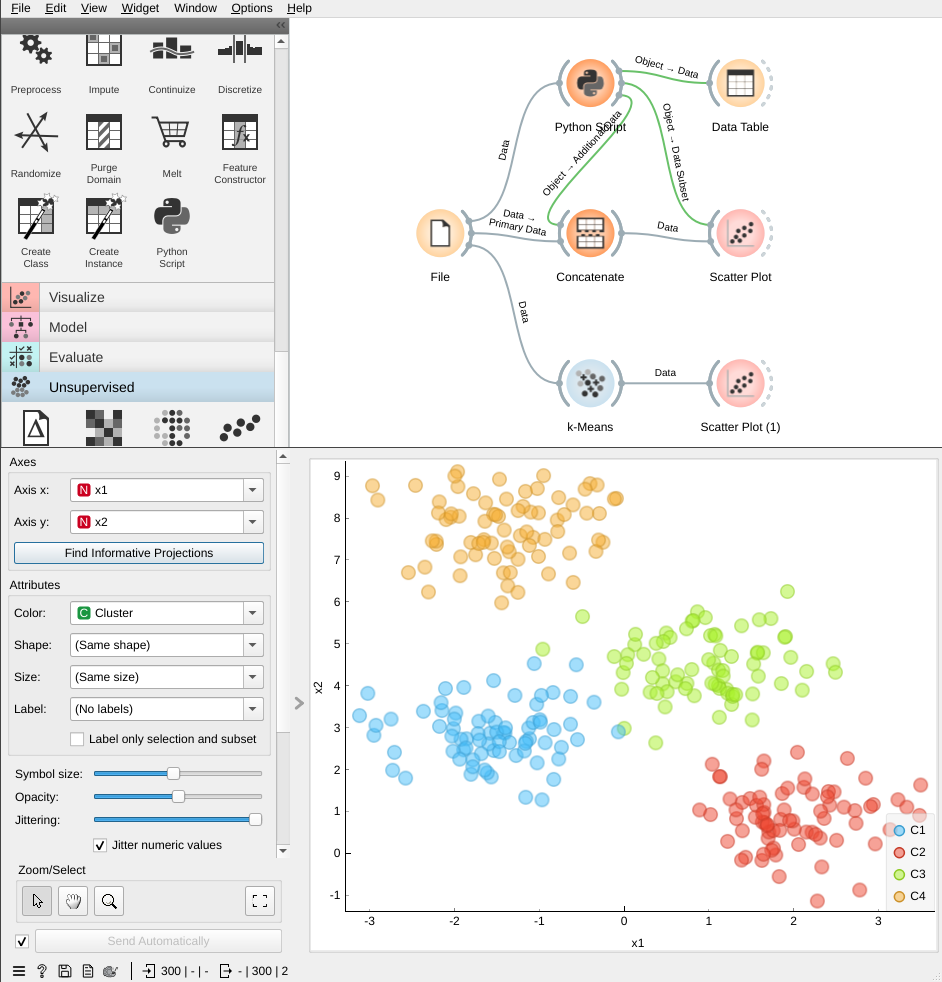
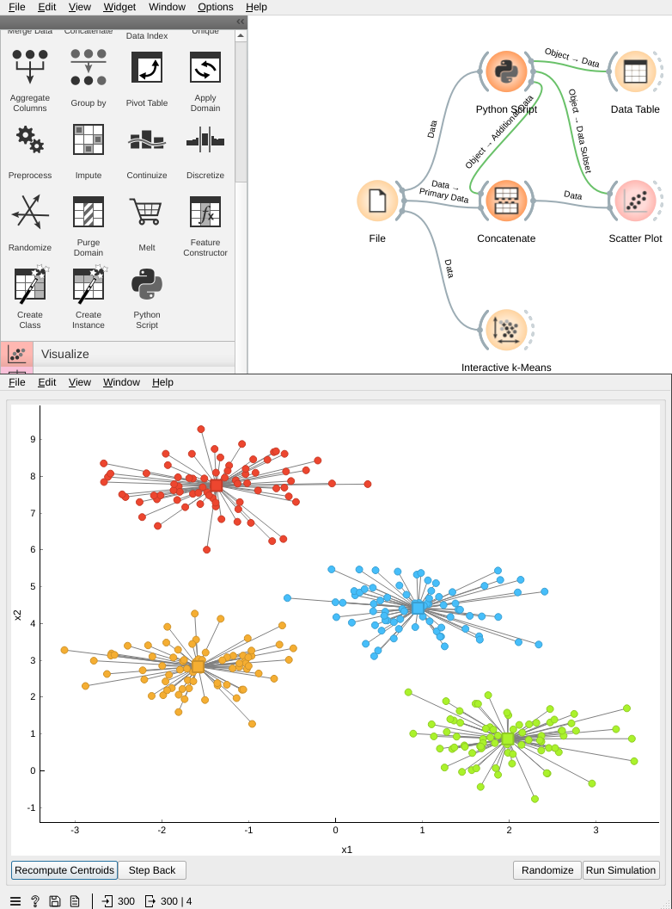
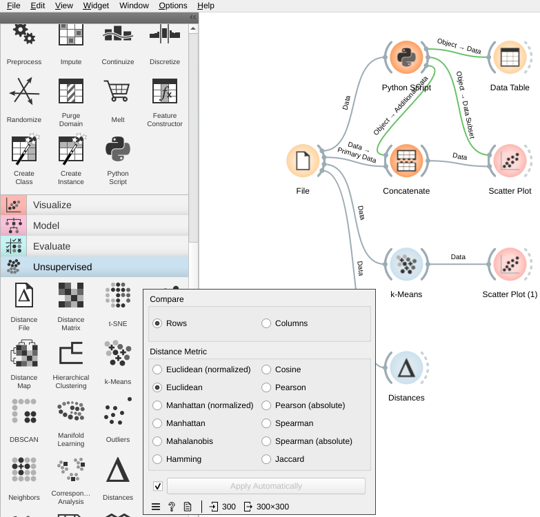
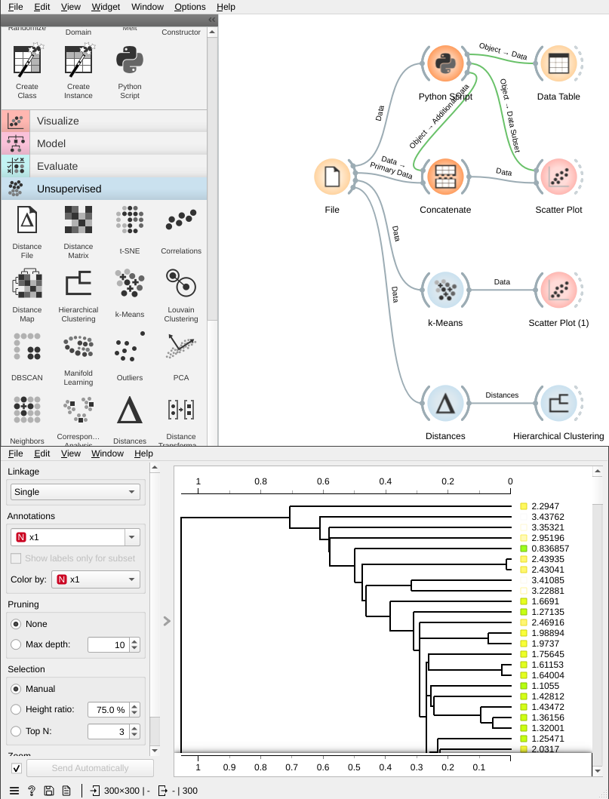
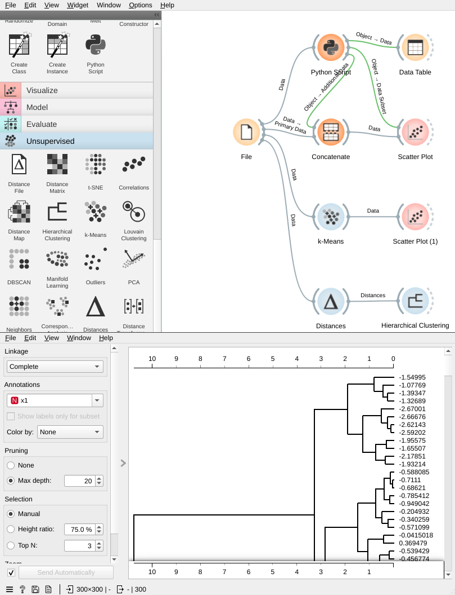

# Lab 9: Data Clustering with Orange3

---

# Introduction

In this lab, you will learn how to use Orange3 to cluster data. You will learn how to use k-means and hierarchical clustering algorithms. You will also learn how to evaluate the performance of a clustering algorithm.

## Objectives

- Understand the concept of clustering
- Learn how to use Orange3 to cluster data using k-means
- Learn how to use Orange3 to cluster data using hierarchical clustering
- Learn how to evaluate the performance of a clustering algorithm

## Prerequisites

- You have read the lecture notes on clustering.

# K-means algorithm

The `k-means` algorithm searches for a pre-determined number of clusters within an unlabeled multidimensional dataset. It accomplishes this using a simple conception of what good clustering results should be:

- The "cluster center" is an average of all the points belonging to the cluster.
- Each point is closer to its own cluster center than to other cluster centers.

Those two assumptions are the basis of the k-means model. The algorithm starts with a first group of randomly selected centroids, which are used as the beginning points for every cluster, and then performs iterative calculations to optimize the positions of the centroids.

## Getting Started

Please create a new workflow and load the `data.csv` dataset into Orange3 with `File` widget and select `data.csv` file in the file dialog.



## An implementation of k-means algorithm by our own

The k-Means algorithm is simple enough that we can write it in a few lines of code. The following is a very basic implementation of k-Means algorithm by using the 'pairwise_distances_argmin' function from `sklearn`. Please add a `Python Script` widget and connect it to the `File` widget. Please copy and paste the following code into the `Python Script` widget.

```python
from Orange.data import Domain, ContinuousVariable, Table
from sklearn.metrics import pairwise_distances_argmin
import numpy as np

rseed = 2
n_clusters = 4

X = np.array(in_data[:,:])
rng = np.random.RandomState(rseed) # random number generator
i = rng.permutation(X.shape[0])[:n_clusters] # select n_clusters data points randomly
centers = X[i] # set the selected data points as centers

while True:
    # Assign labels based on the closest center
    cluster_labels = pairwise_distances_argmin(X, centers)
    
    # Compute new centers per cluster
    new_centers = np.array([X[cluster_labels == i].mean(0)
                            for i in range(n_clusters)])
    
    # Check for convergence
    if np.all(centers == new_centers):
        break
    centers = new_centers

out_data = in_data
out_object = Table.from_numpy(Domain([ContinuousVariable.make("x1"), ContinuousVariable.make("x2")]), centers)
```

To see the output of the `Python Script` widget, please add a `Data Table` widget and connect it to the `object` output of `Python Script` widget. You will see the centers of the clusters in the `Data Table` widget.



## Visualize the centroids

To visualize the clusters with centroids in Orange3, we need to merge the data and the centroids. Please add a `Concatenate` widget and connect it to the `Data` output of `File` widget to its `Primary Data` input. Please connect the `Object` output of `Python Script` widget to its `Additional Data` input.



The `Concatenate` widget will merge the data and the centroids. Please add a `Scatter Plot` widget and connect it to the `data` output of `Concatenate` widget. Then, connect the `Object` output of `Python Script` widget to the `Data Subset` input of `Scatter Plot` widget. The `Scatter Plot` widget will display the clusters with centroids.



## k-means widget from Orange3

Orange3 has a `k-Means` widget that implements the k-means algorithm. Please add a `k-Means` widget and connect it to the `File` widget. Please set the `Number of clusters` to 4, `Initialization` to `Random initialization` and uncheck `Normalize columns`.



## Visualize the clusters

To visualize the clusters in Orange3, please add a `Scatter Plot` widget and connect it to the `data` output of `k-Means` widget. The `Scatter Plot` widget will display the clusters. You could set the `Color` to `Cluster` to display the clusters in different colors.



## Run k-means algorithm interactively

To run k-means algorithm interactively, please add a `Interactive k-Means` widget from `Educational` add-on and connect it to the `File` widget. You may click on the plot to add a cluster center. You may also drag the cluster center to move it or click `Randomize` to randomize the cluster centers.



# Hierarchical clustering

To order to perform hierarchical clustering, we need to calculate the distance between each pair of data points. The distance between two data points is called the linkage. There are several ways to calculate the linkage. The following are the most common ways to calculate the linkage:

- Single linkage: the distance between two clusters is the shortest distance between two points in each cluster.
- Complete linkage: the distance between two clusters is the longest distance between two points in each cluster.
- Average linkage: the distance between two clusters is the average distance between two points in each cluster.
- Centroid linkage: the distance between two clusters is the distance between the centroids of the two clusters.
- Ward linkage: the distance between two clusters is the increase in the sum of squared error when two clusters are merged.
- Weighted linkage: the distance between two clusters is the weighted distance between two points in each cluster.

## Distance widget from Orange3

To calculate the linkage in Orange3, we need to add a `Distance` widget and connect it to the `File` widget. The `Distance` widget will calculate the distance between each pair of data points. Please set the `Distance Metric` to `Euclidean`.



## Visualize hierarchical clustering with dendrogram

To visualize hierarchical clustering in Orange3, we need to add a `Hierarchical Clustering` widget and connect it to the `Distance` widget. The `Hierarchical Clustering` widget will perform hierarchical clustering. Please set the `Linkage` to `Single`.



By default, the `Hierarchical Clustering` widget will display the dendrogram of full tree. We can set the `Max depth` to `20` to display the dendrogram of the first 20 clusters. You could also try `Complete`, `Average`, `Centroid`, `Ward` and `Weighted` for the `Linkage`.

